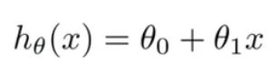
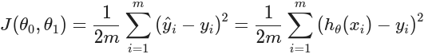
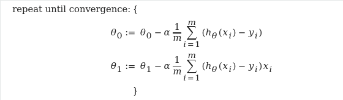

# Implement simple gradient descent for linear regression.
### You will have a simple dataset containing 20 (x, y) points, you should implement a simple gradient decent in Python to calculate best fit for the hypothesis function. These examples are taken from Week 1 in Machine Learning course by Andrew Ng.

**Your [dataset](dataset.csv) is in this folder, named dataset.csv**

|Name| Function|
|:------:| :--------------:|
|**The Hypothesis function** |  |
|**The cost function** | |
|**Gradient Descent** | |

* You don't need to train a model or anything just pure math.
* Your output should be theta0 and theta1, and a plot of the model.
* You should only use python standard library except matplotlib.
* If you find anything hard, you can revise the video associated with it in the course, then in Discord.
